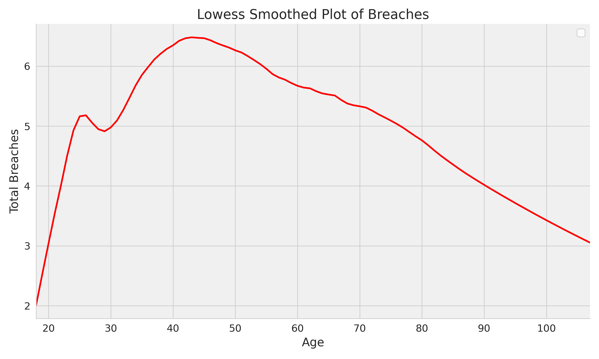

### I Have Been Pwned: Evidence from Florida Voter Registration Data

We query [HIBP](https://haveibeenpwned.com/) with emails from the [Florida voter registration database](https://dataverse.harvard.edu/dataset.xhtml?persistentId=doi:10.7910/DVN/UBIG3F) to estimate how often people's data has been breached. 83.9% of people have had their data breached at least once. The mean number of breaches per email is 6.2, and the median is 5. The average number of serious breaches, e.g., breaches where sensitive data like audio recordings, drug habits, photos, etc., associated with an email, is 3.6; the median is 3. Given that data from only a small sliver of breaches are public and given that these breaches are related to one email (people often have multiple addresses), the total number is likely much higher.

|       |   total_breaches |   serious_breaches |   non_fab_breaches |
|:------|-----------------:|-------------------:|-------------------:|
| count |      1.34819e+06 |        1.34819e+06 |        1.34819e+06 |
| mean  |      6.22427     |        3.65431     |        6.22425     |
| std   |      5.865       |        3.90145     |        5.86484     |
| min   |      0           |        0           |        0           |
| 25%   |      1           |        1           |        1           |
| 50%   |      5           |        3           |        5           |
| 75%   |     10           |        6           |       10           |
| max   |    390           |      333           |      389           |

### Digital Divide: Sociodemographic Predictors of Breaches

The median number of breaches rises sharply from 2.5 to over six between 18 and 45 years before steadily declining to 3. This trend may reflect a combination of things: 1. total number of online accounts (which plausibly increases with age till you reach people who were too old to sign up for too many services), 2. digital savviness, which may be greatest among the youngest. ([Winsorizing](figs/age_winsorized_breaches.png) doesn't change the pattern much.)

The differences across sex and race/ethnicity are not very stark. The difference between the median number of breaches for men and women is zero and the 75th percentile is 1. For race/ethnicity, NH White, NH Black, and 'Other' have a higher median (5) than other racial groups (4).

**Total Breaches by Self-Identified Gender**

| gender   |   count |   mean |   std |   min |   25 |   50 |   75 |   max |
|:---------|--------:|-------:|------:|------:|-----:|-----:|-----:|------:|
| F        |  721828 |    6.4 |   5.8 |     0 |    2 |    5 |   10 |   157 |
| M        |  605040 |    6   |   5.9 |     0 |    1 |    5 |    9 |   390 |

**Total Breaches by Self-Identified Race**

| race_lit         |   count |   mean |   std |   min |   25 |   50 |   75 |   max |
|:-----------------|--------:|-------:|------:|------:|-----:|-----:|-----:|------:|
| Asian            |   30518 |    5.9 |   5.8 |     0 |    1 |    4 |    9 |   154 |
| Hispanic         |  317399 |    5.8 |   5.7 |     0 |    1 |    4 |    9 |   210 |
| Multi-Racial     |   10046 |    5.7 |   5.8 |     0 |    1 |    4 |    9 |   145 |
| NH Black         |  184947 |    5.8 |   5.7 |     0 |    1 |    5 |    9 |   265 |
| NH White         |  750527 |    6.5 |   6   |     0 |    2 |    5 |   10 |   390 |
| Native Americans |    3764 |    5.8 |   5.7 |     0 |    1 |    4 |    9 |    42 |
| Other            |   27028 |    6.2 |   5.9 |     0 |    1 |    5 |    9 |   123 |
| Unknown          |   23957 |    5.3 |   5.6 |     0 |    1 |    4 |    8 |   195 |

### Scripts

1. [Get Emails from Florida Voter DB](notebooks/01_fl_dat.ipynb)
2. [Valid Email Or Not](notebooks/02_valid_email_or_not.ipynb)
3. [Final Data](notebooks/03_create_final_left_table.ipynb)
4. [Get HIBP Data](notebooks/04_get_hibp.ipynb)
5. [Analysis](notebooks/05_concat_fl_dat_analyze.ipynb)

### HIBP Data

https://doi.org/10.7910/DVN/NTN9EP

### References

1. https://gsood.com/research/papers/pwned.pdf
2. https://github.com/themains/bad_domains

